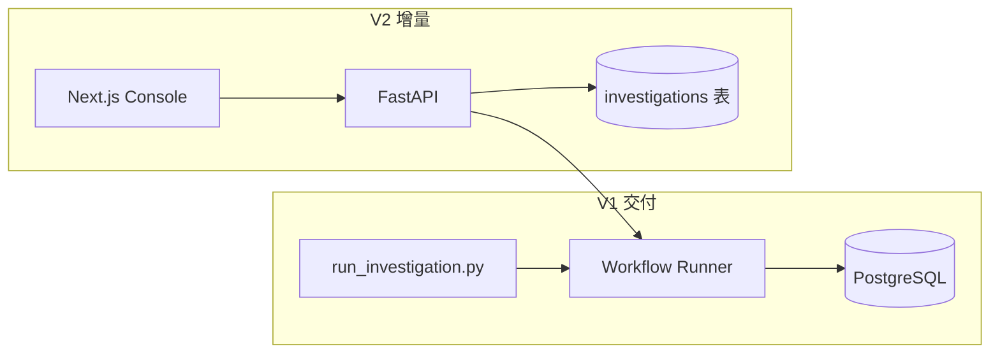

# trans_risk_Agent — AI 交易风控调查 Agent

> **面向面试官**：这是一个「规则 + 数据 + 可选 LLM」的海外现金贷风控分析项目，不是泛 ChatBot。核心是把分析师的 **监控 → 归因 → 结论** 流程做成可复现、可审计的流水线，并在 V2 产品化为可演示的控制台。

[](https://github.com/Czou-hahaha/trans_risk_Agent/tree/V1-version)
[](https://github.com/Czou-hahaha/trans_risk_Agent/tree/V2-version)

---

## 解决什么问题？

海外现金贷风控分析师日常要回答：

1. **核心 KPI 是否异常？**（如 FPD7、通过率）
2. **若异常，恶化/改善主要来自哪些维度？**（渠道、产品、客群等）
3. **能否输出可交付的调查结论？**（给策略/运营，而非模型闲聊）

传统做法依赖 SQL + Excel + 口头经验，**难复现、难留痕**。本项目用 **Skill 文档（规范）+ Python 实现（执行）+ Workflow 编排（顺序）** 把这条链路固化下来。

---

## 版本一览（先看这个）

| 维度 | **V1**（`V1-version` 分支） | **V2**（`V2-version` 分支） |
|------|---------------------------|---------------------------|
| **定位** | 可运行的 **调查流水线 MVP** | V1 的 **产品化控制台** |
| **交付形态** | CLI 一键跑通 `run_investigation.py` | Web：Dashboard + 调查 Timeline + 报告 |
| **编排** | `workflow/runner.py` 三阶段串行 | 复用同一套 `engine/workflow` |
| **数据** | PostgreSQL（指标 + 贡献明细） | 同上 + **调查/步骤/报告持久化** |
| **AI 用法** | 仅 `finding_summary` 阶段调 LLM | 同 V1；其余阶段 **确定性计算** |
| **刻意不做** | 无前端、无多 Agent | 无 LangGraph / RAG / 自主规划 |

详细对比见 **[docs/V1_V2_COMPARISON.md](./docs/V1_V2_COMPARISON.md)**。

---

## 核心流水线（V1 / V2 共用逻辑）

```text
overseas_cashloan_kpi_definitions   # KPI 口径（Skill 文档）
        ↓
metric_monitor                      # 双周期对比 + 是否发起调查（门控）
        ↓  needs_investigation?
dimension_contribution              # 维度贡献 / 归因排序
        ↓
finding_summary                     # 结构化结论（规则 + 可选 DeepSeek）
```

**设计原则（面试可讲）：**

- **Deterministic first**：监控与归因用 SQL + 规则引擎，避免「模型幻觉直接驱动业务」。
- **Gate at monitor**：`|Δ| < 1pp` 可跳过调查，节省算力与噪音。
- **Skill = 可审计规范**：`skills/*.md` 是产品/风控与工程的对齐面，代码是 `skill_runtime/` 的实现。
- **V2 只加「壳」**：持久化、API、前端可视化，**不改** 三阶段业务语义。



---

## 技术栈

| 层 | V1 | V2 增量 |
|----|-----|---------|
| 语言 | Python 3.10+ | TypeScript (Next.js 14) |
| 编排 | 自研 `InvestigationWorkflowRunner` | 同左（`engine/`） |
| 数据 | PostgreSQL + SQLAlchemy | + 调查状态 ORM |
| API | — | FastAPI |
| 前端 | — | Next.js + Tailwind |
| LLM | DeepSeek（summary 阶段） | 同 V1 |
| 测试 | pytest（workflow / 维度覆盖） | engine 测试随 V1 |

---

## 快速体验

### V1 — 命令行跑通一条调查

```bash
git clone -b V1-version git@github.com:Czou-hahaha/trans_risk_Agent.git
cd trans_risk_Agent/v1
cp .env.example .env   # 填入 DEEPSEEK_API_KEY、数据库 URL
pip install -r requirements.txt
docker compose up -d
python tools/seed/seed_from_pkl.py   # 需自备指标 pkl 或按 README 准备数据
python scripts/run_investigation.py
```

### V2 — 可视化控制台

```bash
git clone -b V2-version git@github.com:Czou-hahaha/trans_risk_Agent.git
cd trans_risk_Agent/v2
cp ../v1/.env.example .env   # 或按 v2/README 配置
./scripts/start-all.sh
# 前端 http://localhost:8000  ·  API http://localhost:8001
```

---

## 仓库结构

```text
trans_risk_Agent/
├── README.md                 # 本文件（项目总览）
├── docs/
│   └── V1_V2_COMPARISON.md   # 版本对比（面试重点）
├── v1/                       # 见 V1-version 分支
│   ├── skills/               # 4 份 Skill 规范（业务真相源）
│   ├── skill_runtime/        # 三阶段实现
│   └── workflow/             # 流水线编排
└── v2/                       # 见 V2-version 分支
    ├── engine/               # V1 workflow 复用
    ├── backend/              # FastAPI + 持久化
    └── frontend/             # Next.js 控制台
```

---

## 面试可强调的亮点

1. **业务闭环**：从 KPI 口径文档 → 异常门控 → 维度归因 → 可导出结论，不是单点 demo。
2. **工程化 Skill**：规范与实现分离，方便风控改 `skills/*.md` 而不动编排代码。
3. **可演进路径**：V1 验证算法与数据；V2 加产品能力；V3（本地开发中）可扩展 trend 等模块——分支策略清晰。
4. **克制使用 LLM**：只在总结阶段引入模型，监控/归因可完全离线复现。

---

## 分支与文档索引

| 分支 | 说明 | 详细文档 |
|------|------|----------|
| [`V1-version`](https://github.com/Czou-hahaha/trans_risk_Agent/tree/V1-version) | 流水线 MVP | [v1/README.md](https://github.com/Czou-hahaha/trans_risk_Agent/blob/V1-version/v1/README.md) |
| [`V2-version`](https://github.com/Czou-hahaha/trans_risk_Agent/tree/V2-version) | 调查控制台 | [v2/README.md](https://github.com/Czou-hahaha/trans_risk_Agent/blob/V2-version/v2/README.md) |

---

## License

个人学习 / 面试作品项目。数据与 KPI 口径仅供演示，勿直接用于生产决策。
