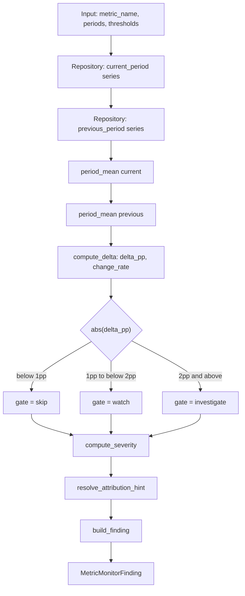

# metric_monitor_skill

**Python 实现**：`v1/skill_runtime/metric_monitor.py` · `v1/skill_runtime/metric_monitor_logic.py` · DB：`v1/tools/db/monitor/`

**口径前置 Skill**：`overseas_cashloan_kpi_definitions.md`

**Status**：Production-ready（由 `workflow/runner.py` 编排）

---

## 1. Skill Purpose

`metric_monitor_skill` 是 **AI Risk Investigation Workflow** 的**入口监控技能**（路线图 **[C] 全景扫描**）。

```text
用户 goal
  → overseas-cashloan-kpi-definitions   # 指标公式、时间窗、样本口径（必读前置）
  → metric_monitor_skill                # 双周期对比 + 是否发起分析 + 归因意图
  → dimension_contribution_skill        # 恶化与向好均需归因拆解
  → finding_summary_skill               # 调查结论合成
```

本 skill **只负责**：

- 从 `metrics_daily` 读取**已按 caliber 聚合好**的日度序列；
- 计算 current / previous 周期均值、`delta_pp`、`change_rate`；
- 按 **周度门控**（默认 |Δ|≥2pp 分析，|Δ|<1pp 跳过）判定 `investigation_gate`；
- 输出 `attribution_hint`，告知下游「查恶化」还是「查改善来源」。

**不负责**：指标公式定义、PKL 聚合、维度 SQL、LLM 报告。

---

## 2. Business Context

风控分析师的日常决策**不只盯恶化**，也包括：

| 方向 | 典型信号 | 是否分析 | 归因问题 |
|------|----------|----------|----------|
| 恶化 | FPD7 上升、长期 period 风险升 | |Δ|≥2pp（周） | 坏在哪里？渠道/规则/客群？ |
| 向好 | FPD7 下降、长期风险下降 | 同上 | 改善来自哪里？是否可持续？ |
| 平稳 | |Δ|<1pp（周） | 否 | — |

**产品形态**影响监控粒度（见 KPI definitions skill）：

- **by 周**：短期波动，默认本 skill 的 7d vs 7d；
- **by 月**：结构性复盘，需 Workflow 显式换窗（后续 `period_type=monthly`）。

**数据血缘（当前）**：

```text
base_data_trans_260323_base_v1.pkl
  → metrics 聚合（口径见 overseas-cashloan-kpi-definitions）
  → metrics_daily 长表
  → metric_monitor_skill
```

规划：`Hive / StarRocks` 替换 PKL 加载，**口径 skill 不变**。

---

## 3. Inputs

`MetricMonitorSkill.run()` 参数：

| 参数 | 类型 | 默认 | 含义 |
|------|------|------|------|
| `metric_name` | `str` | — | 如 `fpd7`、`approval_rate` |
| `current_start_date` | `date` | — | 当前周期起（含） |
| `current_end_date` | `date` | — | 当前周期止（含） |
| `previous_start_date` | `date` | — | 对比周期起（含） |
| `previous_end_date` | `date` | — | 对比周期止（含） |
| `skip_threshold_pp` | `float` | `1.0` | \|Δ\| **小于** 此值 → 不分析 |
| `investigate_threshold_pp` | `float` | `2.0` | \|Δ\| **大于等于** 此值 → 发起分析 |
| `risk_up_is_bad` | `bool` | `true` | 风险率类为 true；「越高越好」指标为 false |

也可用 `MetricMonitorInput` + `run_from_input()`。

### 3.1 周度分析门控（默认）

| \|delta_pp\| | `investigation_gate` | `needs_investigation` |
|-------------|----------------------|------------------------|
| < 1pp | `skip` | false |
| 1pp ~ 2pp | `watch` | false |
| ≥ 2pp | `investigate` | true |

> 1pp~2pp 为观察带：可展示在 Dashboard，不自动拉起完整 investigation（Workflow 可配置覆盖）。

### 3.2 典型 7d vs 7d 窗口

```text
current_period:  BASE_DATE-6 … BASE_DATE
previous_period: BASE_DATE-13 … BASE_DATE-7
```

---

## 4. Outputs

**`MetricMonitorFinding`** 字段：

| 字段 | 类型 | 说明 |
|------|------|------|
| `metric_name` | str | 输入透传 |
| `current_value` / `previous_value` | float | 周期均值（小数率） |
| `delta_pp` | float | (current−previous)×100 |
| `change_rate` | float \| null | 相对变化 |
| `direction` | `up` \| `down` \| `flat` | 变化方向 |
| `investigation_gate` | `skip` \| `watch` \| `investigate` | 分析门控 |
| `needs_investigation` | bool | 是否应发起归因 |
| `is_abnormal` | bool | **兼容字段** = `needs_investigation` |
| `severity` | low \| medium \| high | 基于 \|Δ\| 的展示分档 |
| `attribution_hint` | 见下 | 下游归因意图 |
| `summary_message` | str | 中文摘要 |
| `generated_at` | datetime UTC | 生成时间 |

**`attribution_hint`**：

| 值 | 含义 |
|----|------|
| `risk_deterioration` | 风险恶化方向（如 fpd7 上升） |
| `risk_improvement` | 风险向好（如 fpd7 下降） |
| `neutral` | 基本持平 |

---

## 5. Findings Schema

### 5.1 完整 JSON 示例

```json
{
  "metric_name": "fpd7",
  "current_value": 0.043143,
  "previous_value": 0.02,
  "delta_pp": 2.31,
  "change_rate": 1.1571,
  "direction": "up",
  "investigation_gate": "investigate",
  "needs_investigation": true,
  "is_abnormal": true,
  "severity": "high",
  "attribution_hint": "risk_deterioration",
  "summary_message": "指标 fpd7：当前周期（2026-05-11 ~ 2026-05-17）均值 4.31%，对比周期（2026-05-04 ~ 2026-05-10）均值 2.00%，变化 +2.31pp（相对变化 +115.71%），方向 up，归因意图 risk_deterioration，需发起归因，严重度 high。",
  "generated_at": "2026-05-18T10:00:00Z"
}
```

### 5.2 验收脚本输出

```json
{
  "metric_name": "fpd7",
  "is_abnormal": true,
  "needs_investigation": true,
  "investigation_gate": "investigate",
  "severity": "high",
  "delta_pp": 2.31,
  "attribution_hint": "risk_deterioration"
}
```

---

## 6. Analysis Logic

### 6.1 流程图



### 6.2 代码结构（为何拆分函数）

| 模块 | 职责 |
|------|------|
| `MetricMonitorSkill.run()` | **唯一编排入口**：读库 → 调 logic → 返回 finding |
| `metric_monitor_logic.*` | 可单测的纯函数（`run()` 内逐步调用，非死代码） |

`run()` 调用链：

```text
_load_period_values → period_mean → compute_delta → compute_direction
  → compute_investigation_gate → compute_severity → resolve_attribution_hint → build_finding
```

### 6.3 步骤说明

1. 查询两周期日度 `metric_value`  
2. 各自 `mean()` 得 `current_value` / `previous_value`  
3. `delta_pp = (current − previous) × 100`  
4. 按 \|Δ\| 与 1pp/2pp 阈值得 `investigation_gate`  
5. `severity` 按 \|Δ\| 分档（展示用，与 gate 独立）  
6. 结合 `direction` + `risk_up_is_bad` 得 `attribution_hint`  
7. `build_finding()` 组装输出  

---

## 7. Severity Rules

基于 **`abs(delta_pp)`**（与 `investigation_gate` 独立）：

| 条件 | severity |
|------|----------|
| < 0.2pp | low |
| 0.2 ~ 0.5pp | medium |
| > 0.5pp | high |

---

## 8. Failure Handling

| 场景 | 行为 |
|------|------|
| 周期无数据 | `MetricDataNotFoundError` |
| SQL 失败 | `MetricQueryError` |
| previous=0 | `change_rate=null`，继续 |

---

## 9. Dependencies

| 依赖 | 说明 |
|------|------|
| PostgreSQL `risk_metric_monitor` | 长表 `metrics_daily` |
| `MetricsRepository` | `v1/tools/db/monitor/` 查询层 |
| **overseas-cashloan-kpi-definitions** | 指标公式与时间窗定义（前置阅读） |
| PKL（间接） | 当前 demo 数据血缘 |

---

## 10. Future Extensions

- 月度 `period_type` 与自动选窗  
- `run_batch()` 多指标扫描  
- Hive/StarRocks repository 实现  
- 动态阈值（按历史波动）  
- 接入 `workflow/runner.py` + `findings.metric_monitor`  

---

## Appendix

- [x] `metric_monitor_logic` 纯函数 + `run()` 编排  
- [x] 双向波动 + 2pp/1pp 门控 + `attribution_hint`  
- [x] KPI 口径见 `overseas_cashloan_kpi_definitions.md`  
- [ ] PKL → 长表生产灌库  
