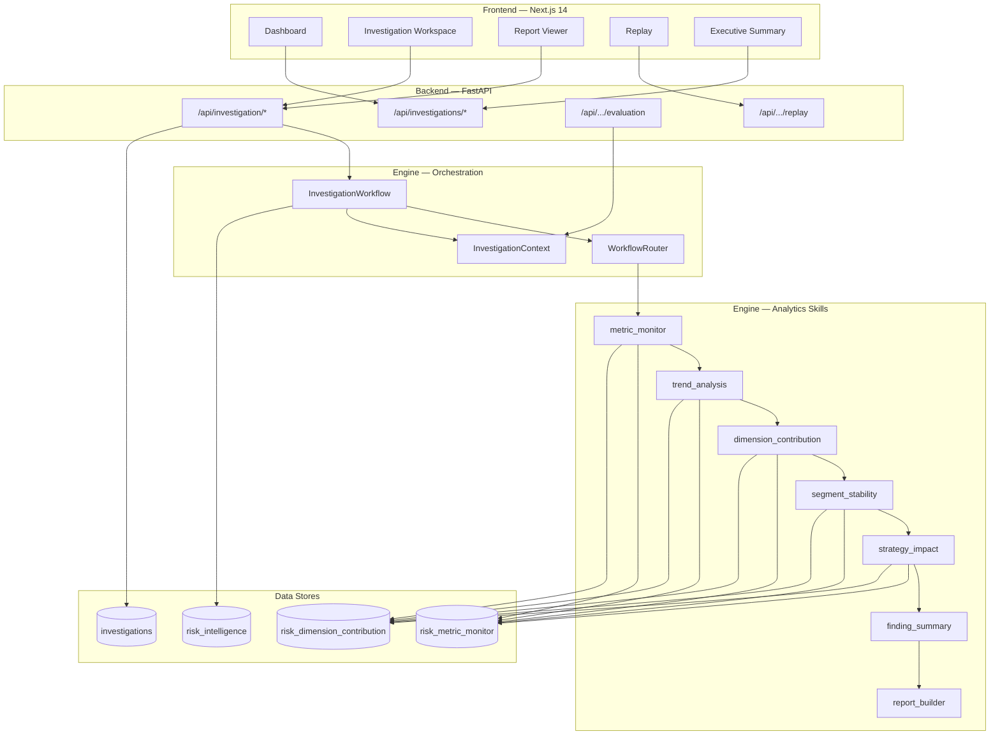
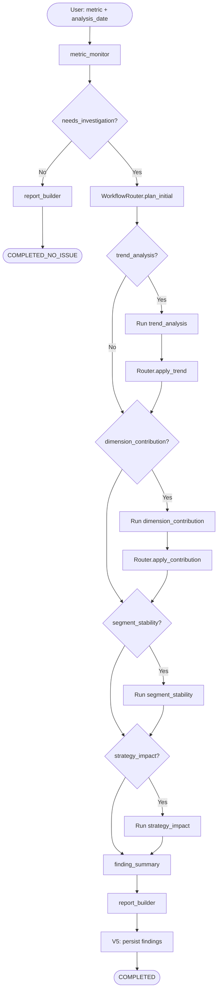
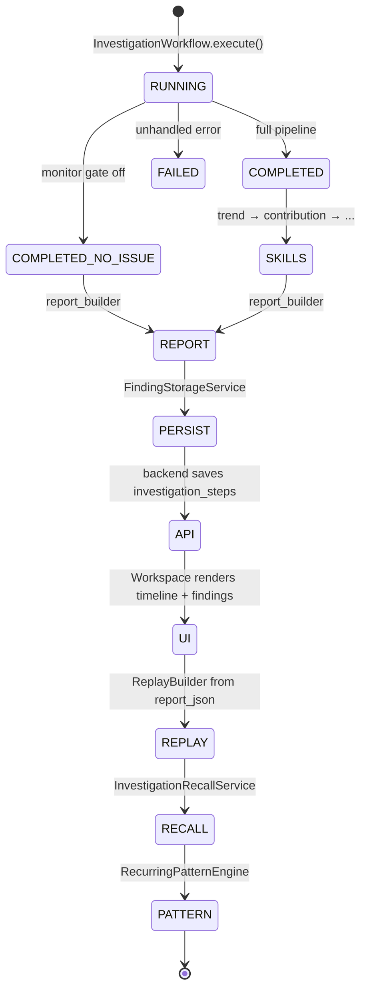
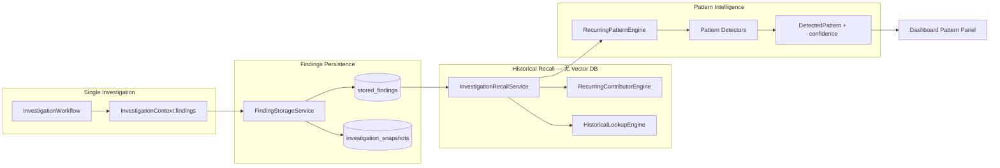

# AI-native Risk Investigation Platform (V5)

> **这不是 ChatBot。** 这是一个将海外现金贷风控分析师的 **监控 → 归因 → 策略影响 → 报告 → 历史召回** 固化为可复现、可审计、可演示流水线的 **AI-native 风险调查平台**。

[](./README.md)
[](./engine/)
[](./frontend/)

---

## Project Overview

**AI 风控分析 Agent — V5** 面向三类场景设计：

| 场景 | 能力 |
|------|------|
| **面试讲解** | 确定性 Workflow、Findings Protocol、Memory 不用 Vector DB 等设计取舍可逐条论证 |
| **作品展示** | Dashboard / Investigation Workspace / Report / Replay / Executive 全链路 UI |
| **工程交付** | Skill 规范与实现分离、Golden Dataset 回归、Evaluation Layer 质量门禁 |

**核心问题**（海外现金贷风控）：

1. 核心 KPI（如 FPD7、通过率）是否异常？
2. 异常来自哪些维度？趋势与 segment 是否稳定？
3. 近期策略上线是否造成副作用？
4. 能否输出可交付的调查报告，并在历史中召回相似案例？

**版本演进**：`v1` MVP CLI → `v2` 控制台 → `v3/v4` 扩展技能链 → **`v5/` 推荐运行入口**（Findings Persistence + Pattern Intelligence + Evaluation + Replay）。

```bash
cd v5 && cp .env.example .env && docker compose up -d
./scripts/start-all.sh
# UI http://localhost:8000  ·  API http://localhost:8001
```

详细文件清单见 [MANIFEST.md](./MANIFEST.md)。深度架构见 [docs/ARCHITECTURE.md](./docs/ARCHITECTURE.md)。

---

## Core Architecture

系统分为 **五层**，自上而下数据流清晰、职责不重叠：

```text
┌─────────────────────────────────────────────────────────────┐
│  Presentation   Next.js Workspace (Dashboard / Investigation │
│                 / Report / Replay / Executive)              │
├─────────────────────────────────────────────────────────────┤
│  API Layer      FastAPI — investigation CRUD, report, replay │
│                 evaluation, dashboard aggregates             │
├─────────────────────────────────────────────────────────────┤
│  Orchestration  InvestigationWorkflow + WorkflowRouter         │
│                 (YAML 驱动路由，无 Agent Planner)              │
├─────────────────────────────────────────────────────────────┤
│  Analytics      skill_runtime + tools/engines + repositories │
│                 (确定性 SQL + 规则引擎，Skill 文档为规范面)   │
├─────────────────────────────────────────────────────────────┤
│  Intelligence   risk_intelligence DB — findings 持久化、      │
│  Memory         Historical Recall、Recurring Pattern Engine  │
└─────────────────────────────────────────────────────────────┘
```

| 目录 | 职责 |
|------|------|
| `engine/workflow/` | 主编排、`WorkflowRouter`、Timeline |
| `engine/skill_runtime/` + `engine/skills/` | 技能实现 + 业务规范文档 |
| `engine/models/` | Findings Protocol（Pydantic） |
| `engine/report/` | 确定性 Markdown 报告 |
| `engine/intelligence_memory/` | 持久化、Recall、Pattern |
| `engine/evaluation/` | 调查质量评估（无 LLM） |
| `engine/replay/` | 调查过程回放 |
| `backend/` | HTTP API + `investigations` 持久化 |
| `frontend/` | 产品级 Workspace UI |

### System Architecture Diagram



---

## Workflow System

V5 使用 **确定性 Workflow**：`InvestigationWorkflow` 在 `metric_monitor` 之后由 `WorkflowRouter` 根据 YAML 规则决定下游技能，而非 LLM 自主规划。

| 触发信号 | 典型下游技能 |
|----------|----------------|
| `needs_investigation` | `trend_analysis`, `dimension_contribution` |
| 趋势恶化 | `segment_stability` |
| 策略部署日临近 | `strategy_impact` |
| 始终（有贡献者时） | `finding_summary` |
| 始终 | `report_builder` |

配置：`engine/workflow_config/configs/*.yaml`（经 `WorkflowConfigLoader` 加载）。

**入口**：

```python
from workflow.investigation_workflow import InvestigationWorkflow

result = InvestigationWorkflow.run(metric_name="fpd7", analysis_date="2026-05-20")
```

CLI：`python engine/scripts/run_investigation.py --metric fpd7 --analysis-date 2026-05-20`

详见 [engine/docs/investigation_workflow.md](./engine/docs/investigation_workflow.md)。

### Workflow Orchestration Diagram



### Sample Investigation Flow

典型 **metric 异常调查** 端到端路径（面试可直接画在白板上）：

```text
metric anomaly          ← metric_monitor：双周期对比，|Δ| 超阈值
        ↓
trend analysis          ← 确认恶化/改善方向与幅度
        ↓
contribution analysis   ← 维度贡献排序，锁定 Top-N 渠道/产品
        ↓
segment stability       ← （可选）不稳定 segment 加固判断
        ↓
strategy impact         ← 策略上线窗口与 KPI 联动
        ↓
report generation       ← InvestigationReportBuilder → Markdown
        ↓
historical recall       ← InvestigationRecallService / Pattern Engine
```

每条边对应 **Timeline 事件 + Findings Protocol 条目**，可在 Workspace 与 Replay 中逐步回放。

---

## Findings Protocol

所有技能输出统一收敛到 **`BaseFinding` 信封**，写入 `InvestigationContext.findings` 并持久化到 `stored_findings`。

```python
# engine/models/base_finding.py
class BaseFinding(BaseModel):
    finding_id: str
    finding_type: Literal["metric_monitor", "dimension_contribution", ...]
    metric_name: str
    summary: str
    evidence: dict[str, Any]
    generated_at: datetime
```

| `finding_type` | 来源 Skill | 关键 evidence 字段 |
|----------------|------------|-------------------|
| `metric_monitor` | metric_monitor | `delta_pp`, `needs_investigation` |
| `trend_analysis` | trend_analysis | `direction`, `delta_pp` |
| `dimension_contribution` | dimension_contribution | `dimension_name`, `contribution_pp` |
| `segment_stability` | segment_stability | `delta_pp`, `stability_score` |
| `strategy_impact` | strategy_impact | `strategy_name`, `impact_summary` |

**与 ChatBot 的区别**：对话输出是自然语言 blob；Findings Protocol 是 **结构化、可校验、可聚合** 的调查证据单元，直接驱动 Report / Evaluation / Memory，无需二次解析模型回复。

---

## Investigation Memory

**Risk Intelligence Storage Layer**（`engine/intelligence_memory/`）在 Workflow 完成后将 findings 写入 Postgres `risk_intelligence`：

| 表 | 用途 |
|----|------|
| `stored_findings` | 跨 investigation 的 finding 行 |
| `investigation_snapshots` | 调查元数据与 findings 计数 |

持久化在 `_persist_findings()` 中执行；失败 **不阻断** 主流程返回。

详见 [engine/intelligence_memory/docs/findings_persistence.md](./engine/intelligence_memory/docs/findings_persistence.md)。

### Investigation Lifecycle Diagram



---

## Pattern Intelligence

在 **Historical Recall** 之上，`RecurringPatternEngine` 做跨 investigation 的 **确定性模式检测**（非 ML、非 embedding）：

| `pattern_type` | 业务含义 |
|----------------|----------|
| `recurring_contributor` | 维度值多次进入 Top-N |
| `recurring_segment_instability` | segment 反复恶化 |
| `strategy_side_effect` | 策略的通过率/风险权衡模式 |
| `approval_risk_shift` | 通过率与风险同向恶化 |

```python
from intelligence_memory.patterns import RecurringPatternEngine

patterns = RecurringPatternEngine().detect_all(metric_name="fpd7")
```

文档：[recurring_patterns.md](./engine/intelligence_memory/patterns/docs/recurring_patterns.md) · [historical_recall.md](./engine/intelligence_memory/recall/docs/historical_recall.md)

### Memory Intelligence Diagram



---

## Frontend Workspace

| 路由 | 功能 |
|------|------|
| `/dashboard` | 调查列表、周趋势、Pattern 摘要 |
| `/investigation` | 启动新调查 |
| `/investigation/[id]` | **三栏 Workspace**：Timeline · Findings · Charts · Report |
| `/reports/[id]` | 独立报告阅读 |
| `/replay/[id]` | 逐步回放 Timeline / Findings 演化 |
| `/executive` | 高管摘要视图 |

技术栈：Next.js 14 · Tailwind · Recharts · remark-gfm。

验收：`tests/frontend_acceptance/`（Playwright + API mock）。

---

## Report System

`InvestigationReportBuilder` 将结构化 findings **确定性** 合成为 Markdown：

```text
Executive Summary → Trend → Key Contributors → Segment Stability
  → Strategy Impact → Risk Recommendations
```

输出：`engine/reports/investigation_{id}.md`  
API：`GET /api/investigation/{id}/report`  
前端：Workspace 底部 Report Preview + `/reports/[id]`

**LLM 仅用于** `finding_summary` 阶段的叙述增强（可选 DeepSeek）；报告骨架由规则与 findings 驱动，可离线复现。

---

## Evaluation Layer

`engine/evaluation/` 提供 **无 LLM** 的质量评估，供 Dashboard 与 Investigation Quality Panel 使用：

| 维度 | Evaluator |
|------|-----------|
| Finding 质量 | `FindingEvaluator` |
| Workflow 一致性 | `WorkflowEvaluator` |
| Report 完整性 | `ReportEvaluator` |
| Pattern 置信度 | `PatternEvaluator` |

```python
from evaluation import EvaluationService
bundle = EvaluationService().evaluate_investigation(result)
```

API：`GET /api/investigations/{id}/evaluation`  
详见 [evaluation_system.md](./engine/evaluation/docs/evaluation_system.md)

Golden 回归：`tests/golden_dataset/benchmark_runner.py`

---

## Technical Design — 四个「为什么」

### 为什么使用 Deterministic Workflow？

| 原因 | 说明 |
|------|------|
| **可复现** | 同一 `metric_name` + `analysis_date` + DB 快照 → 相同 skill 序列与 findings |
| **可审计** | Timeline 记录每步 `execution_status` / `duration_ms`，满足风控留痕 |
| **门控降噪** | `needs_investigation == false` 时跳过昂贵归因，避免「什么都查」 |
| **面试可讲** | 编排与算法分离：改 YAML 路由不改 SQL，改 Skill 文档不改 Workflow |

自主 Agent 规划在 KPI 调查场景引入 **非确定性路径**，难以向业务方解释「为什么今天多跑了 strategy_impact」。

### 为什么 Findings Protocol 比 ChatBot 更稳定？

ChatBot 输出是自然语言，需要二次抽取实体，且 **幻觉可直接污染业务结论**。Findings Protocol 要求：

- 固定 schema（`finding_type` + `evidence`）
- Pydantic 校验后再持久化
- Report / Evaluation / Memory **同一数据源**
- 前端按类型渲染图表，不解析 markdown 表格

稳定性来自 **结构约束**，而非更大的 prompt。

### 为什么不使用 Multi-Agent Runtime？

| Multi-Agent 常见问题 | 本项目的替代 |
|---------------------|-------------|
| 角色对话开销大 | 单进程 `InvestigationWorkflow` 串行/条件执行 |
| 工具调用不可预测 | `skill_runtime` 显式调用 `tools/engines` |
| 调试困难 | pytest + Golden Dataset + Timeline |
| 面试难讲清边界 | 「一个 Workflow，六个 Skill，一个 Protocol」 |

需要并行时，仅在 **数据层**（SQL 聚合）优化，而非 Agent 层竞态对话。

### 为什么 Memory 不使用 Vector DB？

风控历史召回的核心查询是 **结构化** 的：

- `dimension_name = channel AND dimension_value = X`
- `finding_type = strategy_impact AND metric_name = fpd7`
- `contribution_pp > threshold` 在 30 天内出现 ≥3 次

Postgres B-tree / 复合索引即可 **O(log n)** 满足；向量检索引入：

- embedding 成本与漂移
- 相似度阈值难向业务解释
- 「语义相似」≠「风控相似」（contributor 重合才是相似 investigation）

因此采用 **Findings Persistence + Historical Recall + Pattern Engine**，明确不做 RAG / LangChain memory。见 [findings_persistence.md](./engine/intelligence_memory/docs/findings_persistence.md)。

---

## Demo — Screenshots

启动系统后，按 [docs/screenshots/README.md](./docs/screenshots/README.md) 抓取演示图。README 引用路径如下（将 PNG 放入 `docs/screenshots/` 即可渲染）：

### 总览

| 截图 | 路径 | 页面 |
|------|------|------|
| Dashboard | `docs/screenshots/dashboard.png` | `http://localhost:8000/dashboard` |
| Investigation Workspace | `docs/screenshots/workspace.png` | `/investigation/{id}` |
| Workflow Timeline | `docs/screenshots/workflow-timeline.png` | Workspace 左栏 Timeline |
| Report | `docs/screenshots/report.png` | `/reports/{id}` 或 Workspace Report 区 |
| Replay | `docs/screenshots/replay.png` | `/replay/{id}` |
| Executive | `docs/screenshots/executive.png` | `/executive` |


一键抓取（需已 `start-all.sh` 且 seed 数据）：

```bash
cd v5/frontend && npx playwright screenshot http://localhost:8000/dashboard ../docs/screenshots/dashboard.png
```

---

## Quick Start

```bash
cd v5
cp .env.example .env          # DATABASE URLs, optional DEEPSEEK_API_KEY
docker compose up -d
python3.11 -m venv .venv && source .venv/bin/activate
pip install -r engine/requirements.txt -r backend/requirements.txt
python engine/tools/seed/seed_from_pkl.py
./scripts/start-all.sh
```

**测试**：

```bash
cd v5/engine
python -m pytest tests/test_investigation_workflow.py tests/test_findings_persistence.py -v -k "not integration"
cd ../../tests/frontend_acceptance && npm test
```

---

## 面试讲解提纲（3 分钟版）

1. **定位**：AI-native Risk Investigation Platform，不是 chatbot。
2. **链路**：metric anomaly → 多维归因 → 策略影响 → 确定性报告 → 结构化记忆召回。
3. **工程亮点**：Skill 文档与代码分离、Findings Protocol、YAML 路由、Evaluation + Golden 回归。
4. **克制 AI**：仅 summary 可选 LLM；监控/归因/模式检测均可离线复现。
5. **演示**：打开 Workspace + Replay，展示 Timeline 与 findings 逐步出现。

---

## 文档索引

| 文档 | 说明 |
|------|------|
| [docs/ARCHITECTURE.md](./docs/ARCHITECTURE.md) | 架构深度说明（四图 + 模块边界） |
| [MANIFEST.md](./MANIFEST.md) | V5 文件清单 |
| [engine/docs/investigation_workflow.md](./engine/docs/investigation_workflow.md) | Workflow 路由与 Timeline |
| [engine/intelligence_memory/docs/](./engine/intelligence_memory/docs/) | Memory / Recall / Pattern |
| [engine/evaluation/docs/evaluation_system.md](./engine/evaluation/docs/evaluation_system.md) | 评估层 |
| [engine/replay/docs/replay_system.md](./engine/replay/docs/replay_system.md) | 回放系统 |
| [../docs/V1_V2_COMPARISON.md](../docs/V1_V2_COMPARISON.md) | 历史版本对比 |

---

## License

个人学习 / 面试作品。KPI 口径与演示数据仅供展示，勿直接用于生产决策。
